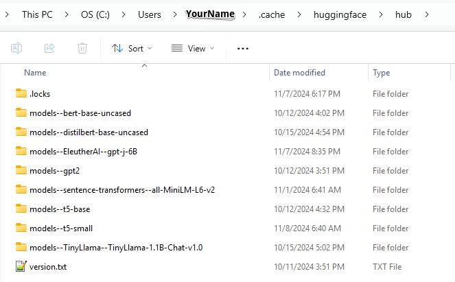

# ezrag

This is a python-based AI RAG research project.


## Table of Contents
- [TLDR](#tldr)
- [Files at Your Service](#files-at-your-service)
- [Features](#features)
- [Limitations](#limitations)
- [Theory of Operation](#theory-of-operation)
- [Prerequisites](#prerequisites)
- [Installation](#installation)
  - [1. Clone the Repository](#1-clone-the-repository)
  - [2. Install Miniconda](#2-install-miniconda)
  - [3. Create and Activate Conda Environment](#3-create-and-activate-conda-environment)
  - [4. Install Poetry](#4-install-poetry)
  - [5. Install Project Dependencies](#5-install-project-dependencies)
- [Running](#running)
- [Contributing](#contributing)
- [License](#license)
- [Contact](#contact)


## TLDR
(Quick start for the brave)
1. make sure you have Python, Miniconda, Poetry installed
1. Run these from command line
   ```
   git clone https://github.com/yourusername/ezrag.git
   cd ezrag
   conda create -n ezrag python=3.12
   conda activate ezrag
   conda install -c conda-forge poetry
   poetry config virtualenvs.create false
   poetry install
   conda activate ezrag
   (if on Windows) runez.bat
   (if on Linux) runez.sh
   ```


## Files at Your Service
The following files or directories are at your service
-   `./EMBEDDINGS`:     temporary directory to store db vector embeddings
-   `./STATS`:          temporary directory to store csv stats about runs executed by ezrag
-   `./docs`:           stores some sample documents that you can "query"
-   `./packages`:       directory of implementation python classes/files/utilities
-   `__init__.py`:      an idiom used by python to indicate that the current dir is a python "package"
-   `main_ai.py`:       the main code to run
-   `runez.bat`:        a wrapper batch file to run the main_ai.py code, using simple menu to help establish commadn line args
-   `pyproject.toml`:   a list of required python modules
-   `./tools`:          some useful tools not part of the main program


## Features
The following are features of the program
* Runs off line, but does require internet to download the project from Github and to download necessary AI models
* Follows basic OO pattern with a Session, AbstractRetriever (AbsRetriever), AbstractChunker (AbsChunker), and AbstractGenerator (AbsGenerator) that can be swapped in and out at run time.  It also includes a stupid-simple retriever that uses a stupid-simple string comparison as its search algorithm.  You can use this retriever to help understand (sort of) how RAG's work.
* Starts up via the command line, but subsequent runs have interactive character-based menu that gets user input from stdin.
* Optionally can be started from bat/sh script with a simple character-based menu that allows you to specify the parameters easily

* Currently the following algorithm is implemented for a Chunker
    * simple chunking (every XYZ bytes)
    * only support txt and pdf files (but you can use the tools/windows_doctopdf.py program to convert doc files to pdf)
    
* Currently the following algorithms are implemented for a retriever
    * Faiss retriever; this uses the all-MiniLM-L6-v2 sentence transformer for embedding/encoding and uses the Faiss for the chunk comparison search.  This retriever also incorporates a re-retrieval after the initial search.
    * Simple retriever; this uses a stupid-simple string comparison for the chunk comparison search 
    
* Currently the following algorithms are implemented for a generator
    * T5-base
    * T5-small
    * Tiny-LLM
    * The generator classes also attempt to minimize the input tokens to the llm if the llm in quesiton supports very few tokens.
* You can mix and match the chunker, retriver, and generator classes as well as the arguments/configurations for them.


* Log output includes timestamp, thread number, file from where the log file originated, current memory usage, example:
    * `[1731195850626] [MainThread] [1026.45 MB] [C\p\e\p\r\faissretriever.py]     ...embedding/encoding chunks took [46.920] secs`

* During retrieving, the top chunk information is printed to the log to also help with deeper investigations and tuning.  This can help you find a spcific chunk match within a specified file and at the offset within the file where the chunk match was found.  A sample is shown here:
      
      ```
      Relevant chunk 2/5:
      Index:         3758
      Chunk score:   0.53
      Chunk source:  Synack - Final UDL Report 2021-05-21 at 02_26 PM.pdf
      LocationInFile:0
      Chunk summary: Fin...
      ```

* A set of "session" and "chunk search" csv files are created to help with stats gathering/viewing.  A sample output is shown here:

    ```
    TIME_MS,SessionNum,VectorEngine,SimilarityType,SimilarityScore,ReretreiveSimType,ReretreivedScore,ApproxPercentScore,ChunkSize,ChunkFileName,OffsetInFile
   1731193154643,1731193152004,,EUCLIDIAN,0.89,COSINE,0.55,55.00%,39,truth.txt,0
   1731193154649,1731193152004,,EUCLIDIAN,1.19,COSINE,0.40,40.00%,512,pj.txt,512
   1731193154658,1731193152004,,EUCLIDIAN,1.30,COSINE,0.35,35.00%,181,letter.txt,0
   1731193154669,1731193152004,,EUCLIDIAN,1.43,COSINE,0.28,28.00%,512,pj.txt,0
   1731193154679,1731193152004,,EUCLIDIAN,1.48,COSINE,0.26,26.00%,269,pj.txt,1024
   ```

* The following options can be set:
    * For the Chunker
        * max chunk size
    * For the Retriever
        * max number of chunks to include in chunk similarity results
        * type of similarity scoring
        * whether to run with quantization
    * For the Generator
        * whether to run with quantization
        * temperature
        
## Limitaions
* Only supports txt and pdf, but there is a doc-to-pdf tool in the ./tools directory.
* Only the listed models are implemented, but different models can be incorporated by creating a 'wrapper' class for a chunker, retriever, or generator
* Only supports EUCLIDIAN, DOT_PRODUCT for initial search, and COSINE for re-retrieval search
* The parsing of the generator LLM response could be hanled better by better prompt handling/engineering, 
* Does not have support for CUDA
* Not a true strategy pattern; right now you have to hard-code in the "main-ai.py" file the different chunker/retriever/generator classes that you want to use.
* Kinda klunky to point to a document directory
* Doesn't handle setting of model's directory, assumes default installation dir (eh, it's saturday at 6PM, whad'ya want?)
    

## Theory of Operation
To do: add class diagram, simple sequence diagram


As mentioned, this project consists basically of a set of abstract RAG-related classes, a chunker, retriever, and generator.  It also uses a "session" object to keep track of various cross-object configuration information and run-time statistic updates.  Additionally, "chunk" object is avilable to store specific information about chunks that the chunker and retriever work with.  The session and chunk objects can be written out to csv files to help with analysis.  Finally, a main class instantiates and runs a RAG session.  At the end of the sessoin, the main program will optionally prompt the user for another run and allow them to tweak their input session config information before re-running.


## Prerequisites

Before setting up the `ezrag` project, ensure that the following software is installed on your machine:

1. **Python 3.12**
   - [Download Python 3.12](https://www.python.org/downloads/release/python-3120/)
   - Make sure you can run `python --version` from a command line
   - You may have to add `C:\Users\RobinCox\AppData\Local\Programs\Python\Python312\` to your PATH
   
2. **Miniconda**
   - [Download Miniconda](https://docs.conda.io/en/latest/miniconda.html)
   - Make sure you can run `conda --version` from a command line
   - You may have to add `C:\ProgramData\miniconda3\Scripts` to your PATH
   
3. **Poetry**
   - [Install Poetry](https://python-poetry.org/docs/#installation)
   - Make sure you can run `poetry --version` from a command line

**Note:** Ensure that both **Conda** and **Poetry** are added to your system's `PATH` during installation to make them accessible from the command line.


## Installation

Follow the steps below to set up the `ezrag` project on your local machine.

### 1. Clone the Repository
```
git clone https://github.com/yourusername/ezrag.git
cd ezrag
```

### 2. Clone LLM Models to Your Hard Drive

These are the models currently used in the ezrag program:

* `all-MiniLM-L6-v2` (for embedding engine)
* `t5-small` (required for t5small encoder/decoder generator)
* `t5-base` (required for t5base encoder/decoder generator)
* `TinyLlama/TinyLlama-1.1B-Chat-v1.0`: (required for tinyllm chat generator)

For Windows, these models are normally downloaded to:

`C:\Users\<YourUsername>\.cache\huggingface\hub`



And for Linux, they are normally downloaded to:

`/home/<YourUsername>/.cache/huggingface/hub`

There are several ways to downlaod the models:
#### Method 1: Cloning Models via Running the Code/w Internet (Lazy Downlaoding)
You can just run the code and the models will be downloaded automagically to the default model directory mentioned above.
#### Method 2: Cloning Models via Running the dowload_llm_models tool
Run the following commands from the repo directory:
1. cd tools
1. python download_llm_models.py
#### Method 3: Download/clone from HuggingFace
You also download the models directory from HuggingFace.  These steps are out of the scope of this readme file, however.
#### Method 4: Download/clone from GitHub
You can also download them from GitHub.  These steps are out of the scope of this readme file, however. 


### 3. Create and Activate Conda Environment

```
conda create -n ezrag python=3.12
conda activate ezrag
```

### 4. Install Poetry in your Conda Environment
```
conda install -c conda-forge poetry
```

### 5. Install Project Dependencies
```
poetry config virtualenvs.create false
poetry install
```
## Running
### 1. Run via batch file (user friendly)
```
cd ezrag
conda activate ezrag
./runez.bat
```
### 2. Run via bash file (user friendly)
```
cd ezrag
conda activate ezrag
./runez.sh <----- TO DO
```

### 3. Run default session (demo-like mode)
```
cd ezrag
conda activate ezrag
python main_ai.py --interactive=False  (to stop after one run)
python main_ai.py                      (to re-run/w options)
```

### 4. Run help
```
cd ezrag
conda activate ezrag
python main_ai.py --help

usage: main_ai.py [-h] [--retriever_name RETRIEVER_NAME] [--generator_name GENERATOR_NAME] [--chunker_name CHUNKER_NAME] [--docs_dir DOCS_DIR] [--chunk_max_num CHUNK_MAX_NUM]
                  [--chunk_size CHUNK_SIZE] [--chunk_dist_scoring CHUNK_DIST_SCORING] [--tempAsStr TEMPASSTR] [--debug DEBUG] [--quantize QUANTIZE]
                  [--interactive INTERACTIVE] [--question QUESTION]

Options for the ezrag program

options:
  -h, --help            show this help message and exit
  --retriever_name RETRIEVER_NAME
                        Retriever class name to use (currently there [is only one -[Naive_ST_FAISS_Retriever])
  --generator_name GENERATOR_NAME
                        Generator class name to use (currently there are: [TinyLLmGenerator,T5SmallGenerator,T5BaseGenerator])
  --chunker_name CHUNKER_NAME
                        Chunker class name to use (currently there is [Simple_Chunker])
  --docs_dir DOCS_DIR   Documents directory
  --chunk_max_num CHUNK_MAX_NUM
                        Maximum number of chunks that the retriever should return
  --chunk_size CHUNK_SIZE
                        Chunking size that the chunker should chunk docs up into
  --chunk_dist_scoring CHUNK_DIST_SCORING
                        Type of similarity/distance scoring within vector search engine of the retriever
  --tempAsStr TEMPASSTR
                        Temperature for generator llm scoring, if any
  --debug DEBUG         Enable debug
  --quantize QUANTIZE   Quantize
  --interactive INTERACTIVE
                        Keep program open after finishing and run interactively
  --question QUESTION   Question you want to ask
```


### 5. Run via command line (you must provide params)
```
cd ezrag
conda activate ezrag
python main_ai.py <cmd line args>  (see help output for valid args)
```

### 6. Special note running with "interactive" flag/arg set to True or False
The `interactive` flag is, by default, set to True.  When set to True, and after the program runs, the program will first allow the user to "rate" the results and will then print out a list of simple args that the user can select from and re-run the program.  Setting the flag to False stops the program after one invocation.

Below is a sample session with the interactive flag set to true.  After the program is finished running, a prompt waits for a score to be assigned to the session, and then a set of options are displayed that the user can select and modify and then re-run.

To change an option, enter the number associated with that option and the option selection value will rotate.  For the Questoin optoin, enter "q" and you will be prompted to enter a new question.  Then, to fire off the next run, enter "r".

```
cd ezrag
conda activate ezrag
python main_ai.py --interactive=True
[C\p\e\main_ai.py]===== Main input parameters: =====
[C\p\e\main_ai.py]retriever name : [Naive_ST_FAISS_Retriever]
[C\p\e\main_ai.py]Generator name : [TinyLLmGenerator]
[C\p\e\main_ai.py]Interactive    : [False]
[C\p\e\main_ai.py]===== End Main Input Params ====
...
... program continues executing, provides final output
...
[C\p\e\main_ai.py]Question: [What is PJ's wife's name and what kind of animal was she?]
[C\p\e\main_ai.py]Answer:   [PJ's wife's name is Margarete and she is a monkey.]
[C\p\e\main_ai.py]================
[C\p\e\main_ai.py]Sources: ['truth.txt (0/71.64%)', 'pj.txt (512/70.91%)', 'pj.txt (1024/67.97%)', 'pj.txt (0/66.36%)', 'letter.txt (0/63.91%)']
[C\p\e\main_ai.py]CSV files for this session/s can be found at: [./STATS]

Rate this answer from 1 (bad) to 5 (good): <<<<< WAITING FOR USER INPUT-- PROVIDE A RATING SCORE HERE >>>>>

[1731259444855] [MainThread] [4701.73 MB] [C\p\e\main_ai.py]CSV files for this session/s can be found at: [./STATS]

Current session settings:
1 retriever_name  Naive_ST_FAISS_Retriever [Naive_ST_FAISS_Retriever, SimpleRetriever]
2 generator_name  TinyLLmGenerator     [T5SmallGenerator, TinyLLmGenerator]
3 chunker_name    Simple_Chunker       [Simple_Chunker]
4 chunk_max_num   5                    [1, 5, 6, 7, 10]
5 chunk_size      512                  [50, 256, 512, 768, 1024]
6 chunk_dist_scoring EUCLIDIAN            [EUCLIDIAN, DOT_PRODUCT, COSINE]
7 tempAsStr       NONE                 [NONE, 0.1, 0.2, 0.5, 0.7]
8 docs_dir        docs/security        [docs/security, docs/airrag_docs, docs/email, docs/geography, docs/reports, docs/wrk, NONE]
9 quantize        True                 [True, False]
10 debug           True                 [True, False]
Q What is PJ's wife's name and what kind of animal was she?

R RUN!
X EXIT
Select an option by number to rotate its values, "R" to run, or "X" to exit.
Your choice:  <<<<< WAITING FOR USER INPUT HERE >>>>>

```

## Dev Notes
### To incorporate a new chunker, retriever, or generator
1. If the new implementation requires an AI model, update the tools/download_llm_models.py with the model name.  Follow the examples in download_llm_models.py.
2. Follow the existing ragimpl classes for examples on how to implement a child of the abstract chunker, retriever, or generator classes.  You will basically need to just implement the public methods of those types.
3. Update the "main_ai.py" file to include your new class.
4. Optionally, update the "runez.bat" and "remenu.py" files to include your new class; this will make it easy for the user to be able to use your class effortlessly.
5. If you follow the basic pattern, you'll be able to bring up your new class at run time, swap it out for another at run time, and maintain a set of logs and csv data files that you can investigate/chart.

### To add new python modules as development continues
This project uses poetry to keep python modules neat.  Use the following command to add new modules:

`poetry add <moduleName>`

### To add new arguments, i.e. options outside of the current options, you should update the following files:
1. session.py (to add options to the Session object)
1. chunk.py (to add options to the Chunk object)
2. runez.bat (to add new options so the user can select them easily)
3. main_ai.py (to add new options to the parser)
4. remenu.py (to add new options so the user can select them easily)
5. ragimpls/yourimplementationClass.py (to any classes that need to use the options)
